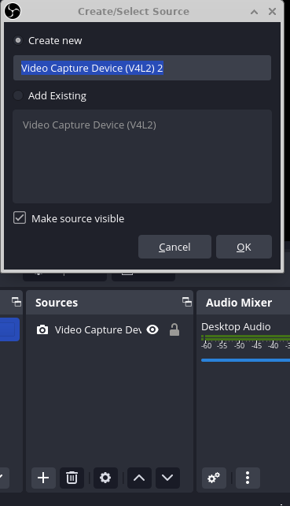
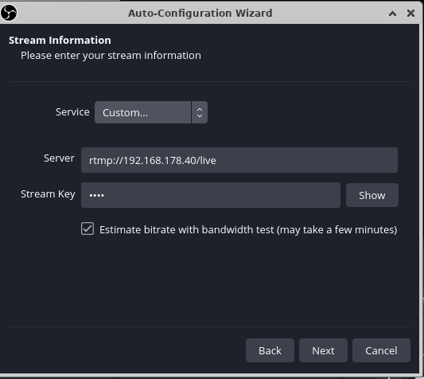
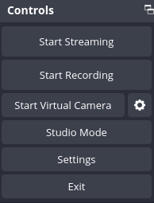
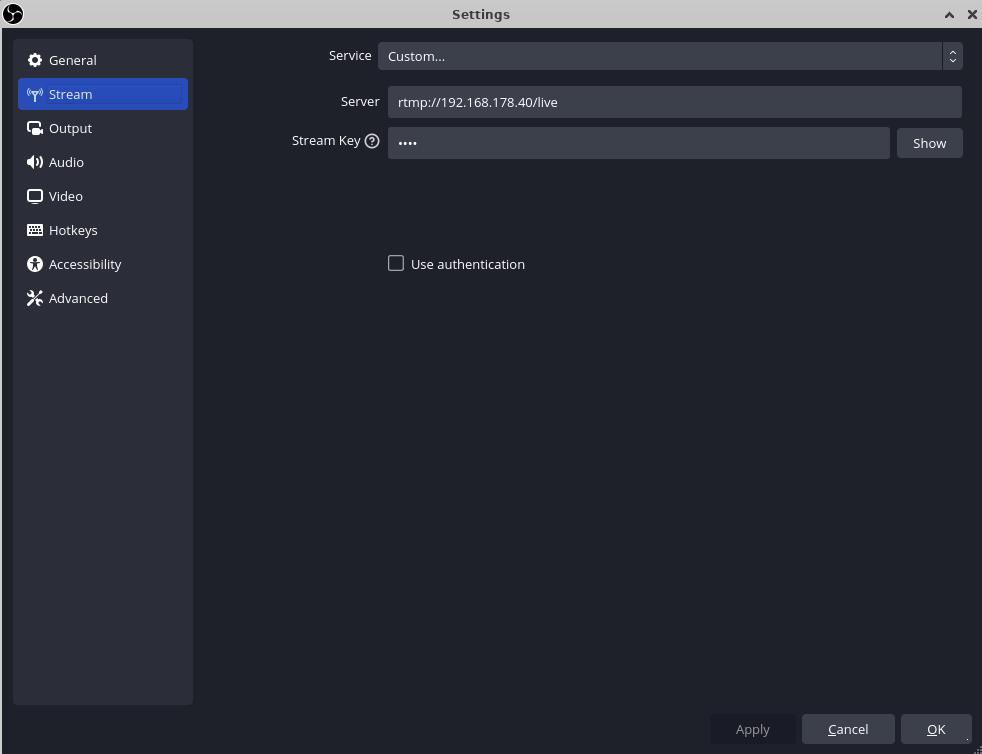
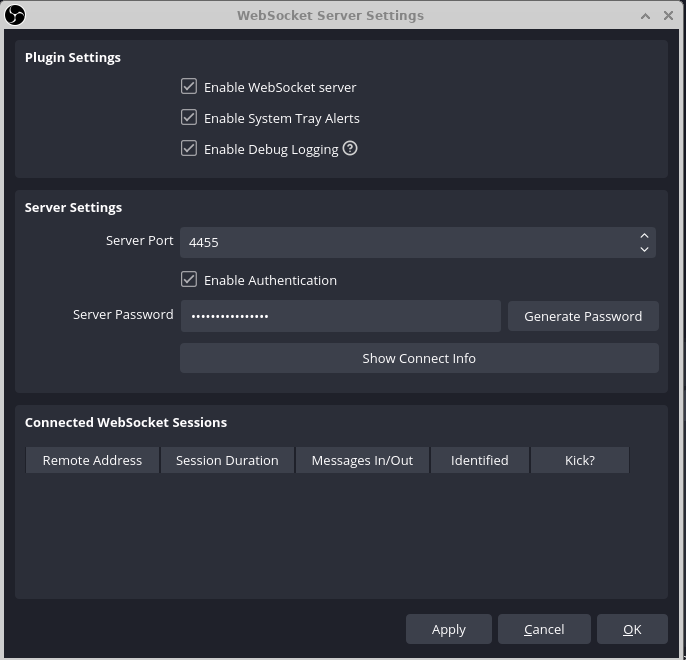
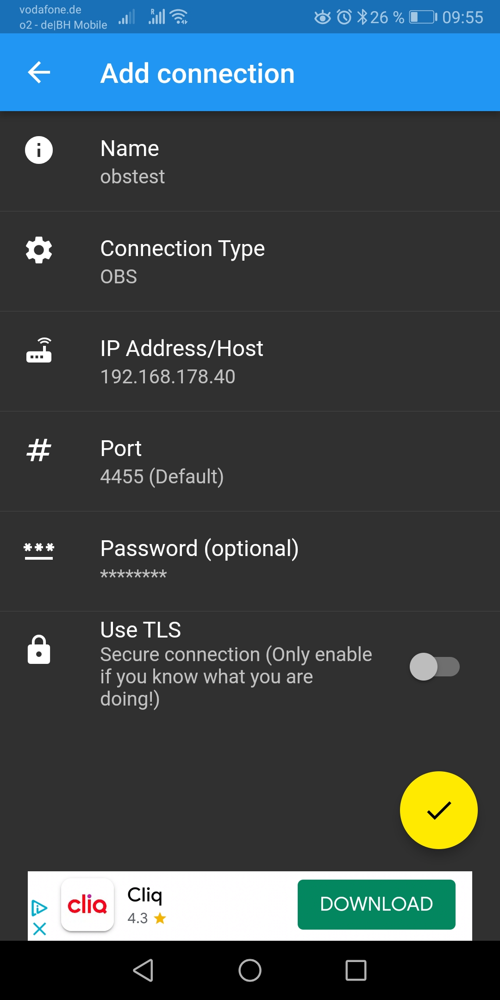
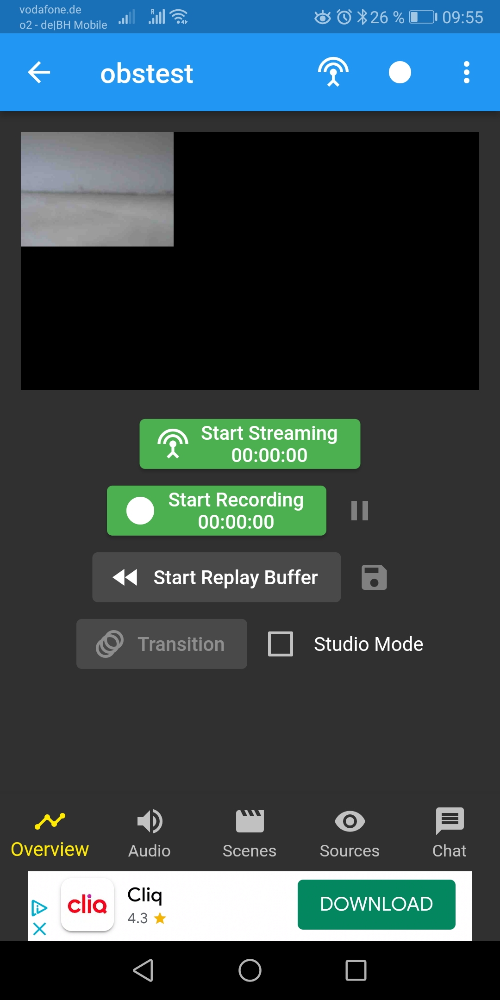
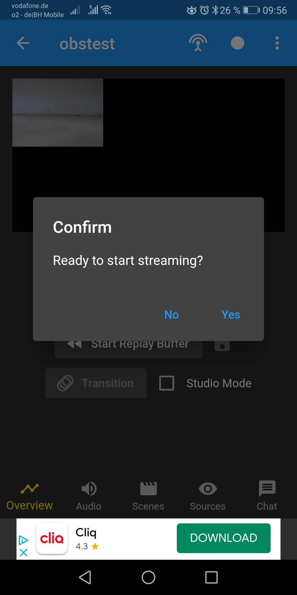
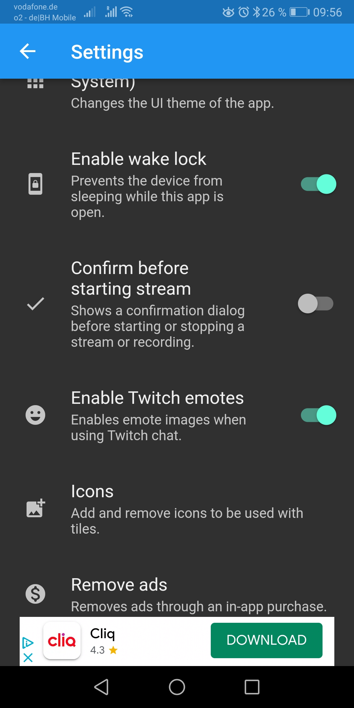

## Purpose 

Free and easy (multi)platform streaming. 

## Tools 

- [Ubuntu 22.04 LTS (Jammy Jellyfish)](https://ubuntu.com/download/server) 
- nginx and libnginx-mod-rtmp ( installed from Ubuntu repositories `apt install nginx libnginx-mod-rtmp` )
- [obs-studio](https://github.com/obsproject/obs-studio/releases/tag/29.0.2)
- [obs-websocket-remote-control](https://github.com/obsproject/obs-websocket/releases/tag/4.9.1-compat) 

Nginx and it's libnginx-mod-rtmp can used for easy live streaming setup

Here are steps how to do it! 

1. Install Ubuntu 
We used Ubuntu 20.0.2. Simply install Ubuntu Server Edition with XFCE ( or any other Desktop Environment you are comforable with ). It can make live easier if you install package sets "Debian desktop environment, GNOME, Xfce", to get DE installed and working run, I find easiest method is to run `tasksel` 

```
# apt install tasksel 
# tasksel 
```
after this in `tasksel` window select desired packages. 


2. Install nginx and nginx-rtmp module 

```
# apt install nginx libnginx-mod-rtmp
```
configure `/etc/nginx/nginx.conf` for rtmp, simple configuration can be like one below, add this at end of `/etc/nginx/nginx.conf`  

```
rtmp {
	server {
		listen 1935;
		chunk_size 4096;
		#allow publish 127.0.0.1;
		#deny publish all;
		application live {
				live on;
				# push rtmp://a.rtmp.youtube.com/live2/xxxxvfffffffffff;
				record off;
			}
	}
}
```
and restart nginx. RTMP configuration can be tweaked with many details - here is minumum example to get it working! 

```
# systemctl restart nginx
```
In above configuration application name ( in section `application live` ) is particurarly improtant to remember as that will be necessary path 
when accessing stream, in our case it it's name is `live`. 


It is also desirable to have at list some firewall control for this machine - Ubuntu has UFW - [Uncomplicated Firewall](https://help.ubuntu.com/community/UFW) package and it is easy to use.

```
# apt install ufw
```

after this open below ports 
```
# ufw enable
# ufw allow 22/tcp
# ufw allow 1935/tcp
# ufw allow 4455/tcp 
```

reload firewall rules 
```
# ufw reload 

# ufw status 
Status: active

To                         Action      From
--                         ------      ----
22/tcp                     ALLOW       Anywhere                  
1935/tcp                   ALLOW       Anywhere                  
4455/tcp                   ALLOW       Anywhere                  
22/tcp (v6)                ALLOW       Anywhere (v6)             
1935/tcp (v6)              ALLOW       Anywhere (v6)             
4455/tcp (v6)              ALLOW       Anywhere (v6)             
```

With above Ubuntu server should be OK.  

3. install obs-studio 

I never used OBS Studio before and was positevely suprised that it has huge community and big user base, and it seems that community aroud it quite vibrant and proactive. 

For OBS I decided to use newest availble from [OBS Studio Github](https://github.com/obsproject/obs-studio). Pay attention to pick packages which are corresondig to your server version. In our case here we have Ubuntu 22.04 LTS (Jammy Jellyfish) so we downloaded `obs-studio_29.0.2-0obsproject1_jammy_amd64.deb` from [gitbub](https://github.com/obsproject/obs-studio/releases/tag/29.0.2)

Do same for [obs websocket](https://github.com/obsproject/obs-websocket/releases/tag/4.9.1-compat) package and get `obs-websocket-4.9.1-compat-Ubuntu64.deb`

```
# mkdir /home/packages; 
# cd /home/packages 
# wget https://github.com/obsproject/obs-websocket/releases/download/4.9.1-compat/obs-websocket-4.9.1-compat-Ubuntu64.deb 
# wget https://github.com/obsproject/obs-studio/releases/download/29.0.2/obs-studio_29.0.2-0obsproject1_jammy_amd64.deb
# apt install obs-studio_29.0.2-0obsproject1_jammy_amd64.deb
# apt install obs-websocket-4.9.1-compat-Ubuntu64.deb
```

These packages are actual at time of this writting ( Feb 2023 ), pick up correct versions :) 


4. Configure OBS studio 

Here we have to do below

4.1 -  setup video source 




Follow steps in OBS video source auto vizard to configure video source, pay attention to point to rtmp location and to provide previously defined streaming key.



4.2 - check in OBS stream settings section is proper address in place!




and specify OBS stream parameters - this should point to your rtmp server ( check `/etc/nginx/nginx.conf` )




5. Configure Websocket Server settings 

Still in OBS studio, go to `Tools -> Websocket Server Settings` and configure access via web socket 


Here is important to write down generated password ( or to set custom one )

With this setup is in place, we can start / stop streaming / recording from OBS studio. 
[start-stop-streaming](./pictures/obs-settings.png)

This can be used like this, but there is simpler way to install [StreamCtrl](https://play.google.com/store/apps/details?id=dev.t4ils.obs_remote&hl=en_US&gl=US) application from Android market and start/stop stream/recording via mobile phone. There are probably other application which can be used for this, but we use StreamCtrl here. 

Install StreamCtrl on an android device and add connection to OBS stream per credentials defined in Websocket settings section 


After this start streaming from phone will be possible!



If find it annoying to always confirm before starting to stream 





but this can be disabled in StreamCtrl settings section 



It is possible to get all this working with Debian, Fedora, I even saw examples of similar setup running on FreeBSD, but 
our choice was Ubuntu due to good OBS Studio support! 

Additional notes:

- Test Stream quality for different camera / microphone settings 
- Stream recordings location can be changed under OBS Studio `Settings->Output->Recording Path`. Depending on video resolution these files can take quite some space. Plan accordingly to have enough space for video recordings. 
- This configuration works for Youtube - uncomment in `nginx.conf` part `push rtmp://a.rtmp.youtube.com/live2/xxxxvfffffffffff;` - and provide your 
youtube stream key. 
- Similar configuarion would be to add additional stream destination in this [video](https://www.youtube.com/watch?v=vDxo0JiV0q0) there is an example. 
- StreamCtrl expect to have access to OBS Stream web socket web address. In this configuration we tested it locally, for remote access it will be probably necessary to check / adapt network access for it.


Happy Streaming! 